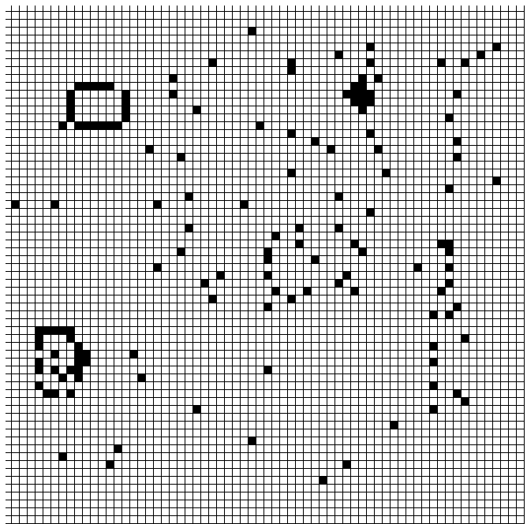
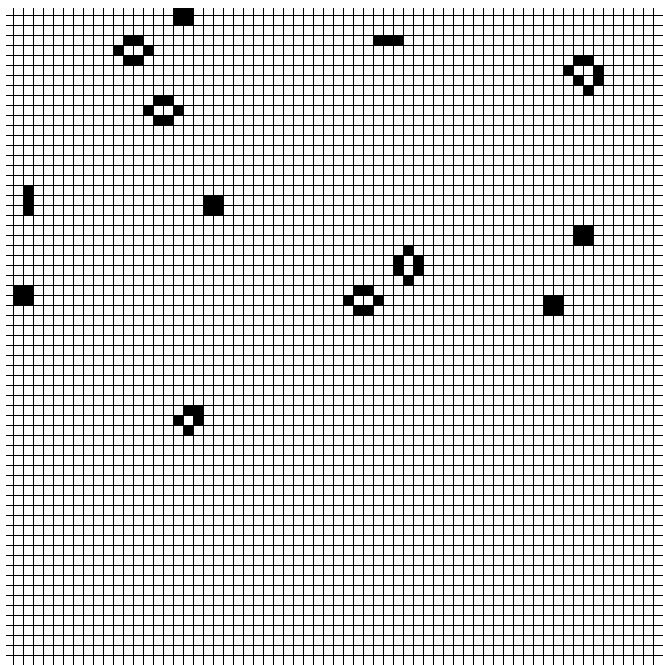

# JEU DE LA VIE

 Le jeu de la vie est un automate cellulaire, une grille de cellules contenant chacune un état qui peut évoluer au cours du temps. Imaginé par John Horton Conway en 1970, le Jeu de la Vie est un des automates cellulaires les plus connus puisqu'il est imaginé avec quatre règles simples et qu'il mène à des résultats riches et variés. Ces quatre règles sont simples :
- Une cellule "survie" au tour suivant si elle est entourée de 2 ou 3 cellules voisines.
- Une cellule "meurt" au tour suivant si elle est entourée de 1 ou 0 cellule voisine (mort par isolement).
- Une cellule "meurt" au tour suivant si elle est entourée de 4 à 8 cellules voisines (mort par surpopulation).
- Une cellule "apparait" au tour suivant si elle est vide au tour n et entourée de 3 cellules voisines pleines (naissance).

Notre projet vise donc à voir si un ou plusieurs patterns peuvent réapparaitre au fil du temps, et ce, peu importe la configuration de départ. 
Pour répondre à la problématique, nous allons coder un programme en Python se basant sur le modèle de la simulation de dimension 2 et des 4 règles. Ce programme nous permettra ainsi, tout d'abord de faire simulation avec une configuration manuelle puis, une configuration automatique afin d'observer les résultats.

## THE GAME OF LIFE
The Game Of Life is a cellular automaton, a grid of cells each containing a state that can change over time, imagined by John Horton Conway in 1970, the game of life is one of the most well-known cellular automata since is imagined with four simple rules and that it leads to rich and varied results. These four rules are simple:
- A cell "survives" at the next round if it is surrounded by 2 or 3 neighboring cells.
- A cell "dies" at the next round if it is surrounded by 1 or 0 neighboring cells (death by isolation).
- A cell "dies" in the next round if it is surrounded by 4 to 8 neighboring cells (death by overcrowding).
- A cell "appears" in the next round if it is empty in round n and surrounded by 3 neighboring full cells (birth).

Our project therefore aims to see if one or more patterns can reappear over time, and it does not matter the initial configuration. To answer the problem, we will write a program in Python based on the dimension simulation model 2 and 4 rules. This program will allow us, first of all to make a simulation with a manual configuration then an automatic configuration in order to observe the results.

## Présentation de l'équipe

|(´・ω・｀)| ( ͡° ͜ʖ ͡°) | ಠ_ಠ | ᕕ( ᐛ )ᕗ |
|-----|--|--|--|
| G.Kounkoud | Y. Soukehal | K. Vallipuram | C. Lebrati  |

## Description synthétique du projet

**Problématique :** 

Est-il possible d'avoir un ou plusieurs modèles récurrents (pattern) pour des placements de cellules différents ?

**Hypothèse :**

Ce travail s'axant sur une simulation de dimension 2 et a un espace d'évolution défini, l'hypothèse de ce travail de recherche est que oui, il est possible d'avoir un ou plusieurs modèles récurrents pour des placements de cellules différents. 

**Objectifs :**

Notre projet vise à essayer de comprendre très schématiquement comment un ensemble d'atomes peut donner des systèmes complexes, comme par exemple des organes lors des différentes étapes de la méiose, système de division cellulaire du vivant).

**Critère(s) d'évaluation :**

Evaluer les résultats des simulations à configuration manuelles et automatiques (aléatoires).

## Présentation structurée des résultats

A l'aide d'un code Python, nos résultats seront présentés sous forme de tableau à 2 dimension qui permettra d'illustrer nos simulations.
Ces simulations sont alors effectuées en 2 phases. Une première phase dites "Phase 1" qui présente une simulation avec une configuration manuelle. Et une seconde phase dite "Phase 2" qui présente une simulation avec une configuration automatique (aléatoire).

**Phase 1 :**
Ci-dessous vous trouverez le début d'une des simulations manuelles (c'est a dire les cellules présentes ont été placées manuellement sur le tableau):

Voici un des résultats de cette simulation. On peut observer que plusieurs patterns sont apparus:

 **Phase 2 :**
Debut de simulation, avec donc des cellules placées aléatoirement:

Voici le résultat de cette simulation. On peut observer que plusieurs paternes ont apparus:

**Analyse**

Tout d'abord la simulation peut être effectuée à partir d'une cellule ou plus. Car en configuration manuelle si l'on lance une simulation sans avoir placé de cellule, on obtient les résultats précédents. On peut ainsi observer de nos deux débuts de simulations que les emplacements de cellules au départ sont totalement différents. Mais à la fin de la simulation on a quand même une apparition de d'un ou plusieurs patterns simples. Ainsi on peut conclure que notre hypothèse est bien valide, que l'apparition de pattern est inéluctable.

## Lien vers page de blog : <a href="blog.html"> C'est ici ! </a>

**Carte mentale**
Voici notre Carte mental 

## Bibliographie :
1-« Le Jeu de la Vie – Science étonnante #49 » par Science Etonnate le 8 décembre 2017
https://youtu.be/S-W0NX97DB0

2-«Jeu de la vie » par Jean-Jacques ROUSSEAU
http://ressources.univ-lemans.fr/AccesLibre/UM/Pedago/physique/02/recre/conway.html

3-« What is the Game of Life ? » par Paul Callahan http://www.math.com/students/wonders/life/life.html

4-« Layout Managers/ Geometry Manager», design by Denise Mitchinson adapted for python-course.eu by Bernd Klein
https://www.python-course.eu/tkinter_layout_management.php

5-https://fr.m.wikipedia.org/wiki/Automate_cellulaire (source tertiaire)

6-https://fr.m.wikipedia.org/wiki/Jeu_de_la_vie (source tertiaire)
